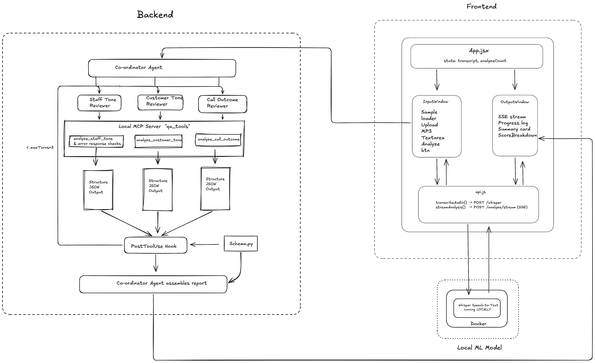

# CallAnalyser

**Author:** Shams Anjum, 2026

A configurable hub-and-spoke multi-agent QA system for analyzing call center recordings. A coordinator dispatches three specialized AI reviewers in parallel — agent tone, patient tone, and call outcome — and streams live progress to the browser as each result arrives.

Currently demoed with hospital support calls.

**Live demo:** [https://call-analyzer-coral.vercel.app](https://call-analyzer-coral.vercel.app)  
**API health:** [https://callanalyzer.onrender.com/health](https://callanalyzer.onrender.com/health)

## Demo Video
[](https://youtu.be/2b7BmxjxxoU)

---

## Architecture



### Why hub-and-spoke?

This app uses a **coordinator** (the hub) that sends work to **three specialist agents** (the spokes): agent tone, patient tone, and call outcome. Each agent focuses on one job and returns structured scores.

**When this design works well**

- Long or complex calls with many topics to judge
- You want separate scores per area (not one vague summary)
- You can run reviewers in parallel and catch mistakes per role

**The tradeoff**

- **More API calls = more tokens** than a single agent reading the transcript once
- For **short, simple calls**, one agent with one JSON output is often **cheaper and faster**, with a small drop in depth per category

**Rule of thumb:** hub-and-spoke is a good fit when the conversation is big enough that splitting the work helps quality. For small transcripts, a single direct agent is usually the better choice on cost.

---

## Features

- **Parallel AI reviewers** — agent tone, patient tone, and call outcome scored simultaneously
- **Live streaming UI** — real-time progress via Server-Sent Events as each reviewer completes
- **Structured output** — every report is schema-validated before it reaches the frontend
- **Audio upload** — drop an MP3 and Whisper transcribes it before analysis
- **Flag & score** — composite support score with automatic flagging on threshold breaches

---

## Prerequisites


| Requirement                                 | Download                                                                                           |
| ------------------------------------------- | -------------------------------------------------------------------------------------------------- |
| Python 3.11+                                | [python.org](https://www.python.org/downloads/)                                                    |
| Node.js 18+                                 | [nodejs.org](https://nodejs.org/)                                                                  |
| Anthropic API key                           | [console.anthropic.com](https://console.anthropic.com/)                                            |
| Whisper server *(optional, for MP3 upload)* | Run a Docker container exposing an OpenAI-compatible endpoint on `:9000` — e.g. `docker run -p 9000:9000 onerahmet/openai-whisper-asr-webservice` — or any other [whisper.cpp](https://github.com/ggerganov/whisper.cpp) compatible server |


---

## Installation

```bash
# 1. Clone
git clone https://github.com/your-username/CallRecordingAnalyzer.git
cd CallRecordingAnalyzer

# 2. Python virtual environment
python -m venv .venv
source .venv/bin/activate        # Windows: .venv\Scripts\activate

# 3. Backend dependencies
cd backend && pip install -r requirements.txt

# 4. Environment variables — create backend/.env with the following:

ANTHROPIC_API_KEY=sk-ant-...       (used by all AI reviewers)
OPENAI_API_KEY=sk-...              (for whisper audio transcription)
DEMO_MODE="true" or "false" depending on if you have api keys                   
                                       

# Example minimal setup (text-only, no audio upload):
echo "ANTHROPIC_API_KEY=sk-ant-...\nDEMO_MODE=true" > backend/.env

# 5. Frontend dependencies
cd ../frontend && npm install
```

---

## Usage

Open two terminals from the repo root.

```bash
# Terminal 1 — Backend API (http://localhost:8000)
source .venv/bin/activate
cd backend && uvicorn api.main:app --reload

# Terminal 2 — Frontend (http://localhost:5173)
cd frontend && npm run dev
```

Open `http://localhost:5173`, paste or load a transcript, and click **Analyze**.

To run the pipeline directly on all sample transcripts without the UI:

```bash
cd backend && python agent/hub_spoke.py
# Reports written to backend/output/*.json
```

---

## Contributing

1. Fork the repo and create a feature branch.
2. Keep each reviewer tool focused on a single scoring concern.
3. Run `python agent/verify_outputs.py` before opening a PR to confirm outputs validate against the schema.

---

